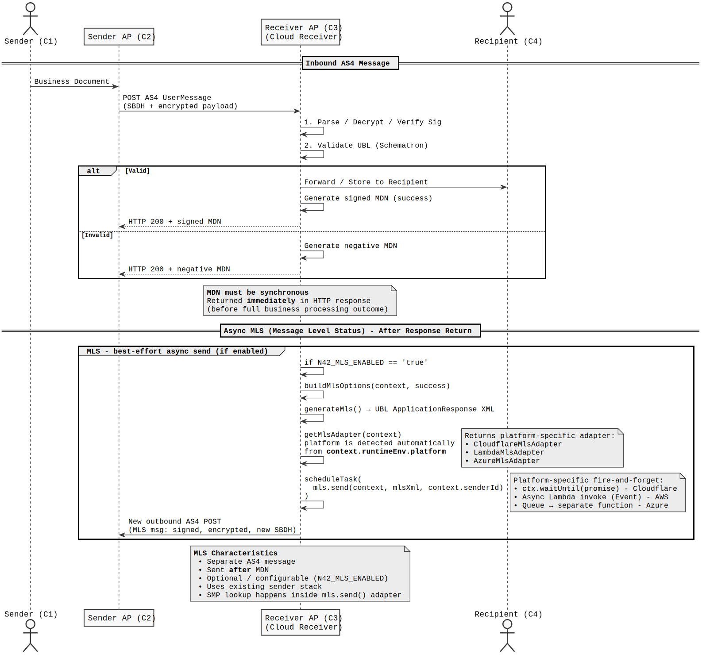

## MLS from Edge-Deployed Receivers

Sending a Peppol Message Level Status (MLS) back to C2 after receiving a business document 
presents a unique challenge when the receiver is deployed as a serverless edge function.

### The Problem

The AS4 protocol requires the receiver (C3) to **return an MDN synchronously as the HTTP response 
to the original POST**. This means the function must return before any further processing can occur. 
However, **the MLS must be sent after the document has been processed** and delivered towards C4 — 
meaning it cannot be part of the synchronous response path.

On traditional servers this is trivial — send the MDN, continue processing in the background. 
On serverless platforms the runtime freezes or terminates the execution environment the moment 
the response is returned, making background tasks unreliable or impossible.

### The Solution

A platform-aware `scheduleTask()` abstraction was introduced in `N42Environment` that handles 
the async execution gap differently per platform:

- **Cloudflare Workers** — `ctx.waitUntil(promise)` keeps the worker alive after the response 
  is sent, allowing the MLS send to complete reliably without blocking the MDN response.

- **AWS Lambda** — the MLS send is triggered as an asynchronous Lambda invocation 
  (`InvocationType: 'Event'`), decoupling it entirely from the original execution context 
  with built-in retry support.

- **Azure Functions** — the MLS task is queued via Azure Storage Queue, consumed by a 
  separate function instance, ensuring reliable delivery independent of the receiver's lifecycle.

This keeps the core receiver logic (`receiver/as4.js`) platform-agnostic — it simply calls 
`context.runtimeEnv.scheduleTask(mls.send(...))` while the platform integration handles the execution strategy.

## Cloud Receiver – Sync MDN vs Async MLS Flow

  

In the Peppol architecture, reliability often requires balancing strict protocol requirements with the constraints of modern serverless runtimes. 

The `scheduleTask()` abstraction addresses this by cleanly separating the **synchronous MDN** requirement from the **asynchronous delivery of MLS**.

By keeping the core receiver logic platform-agnostic while delegating the complexity of post-response execution to environment-specific adapters, the design achieves both spec compliance and practical robustness across different cloud platforms.